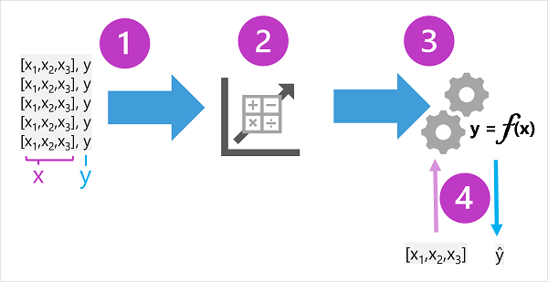
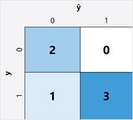
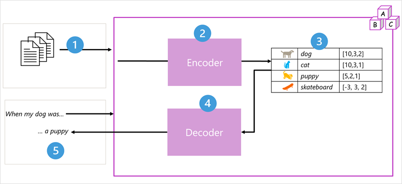

# Azure AI Fundamentals

  
*Diagram showing the training and inferencing phases in machine learning.*

## Generative AI
Generative AI is a branch of AI that enables software applications to generate new content, such as natural language dialogs, images, video, code, and other formats. This capability is based on a language model trained with vast amounts of data, often sourced from the internet or other public information repositories. Generative AI understands semantic relationships between words, allowing it to produce coherent and meaningful sentences. Models are categorized as:
- **LLMs (Large Language Models)**: Powerful and generalize well but are costly to train and use.
- **SLMs (Small Language Models)**: Effective for specific topics and generally more cost-efficient.

---

## Computer Vision
Computer vision involves training models with large datasets of images to perform tasks like:
- **Image Classification**: Labeling images based on their main subject.
- **Object Detection**: Identifying the location of specific objects in an image.
- **Semantic Segmentation**: Advanced object detection where individual pixels are identified as belonging to an object.
- **Multi-modal Models**: Combining computer vision with generative AI for enhanced capabilities.

  
*Diagram showing supervised machine learning (regression and classification) and unsupervised machine learning (clustering).*

---

## Natural Language Processing (NLP)
NLP models analyze text for various purposes. Common tasks include:
- **Entity Extraction**: Identifying people, places, or organizations in text.
- **Text Classification**: Assigning documents to specific categories.
- **Sentiment Analysis**: Determining if text is positive, negative, or neutral.
- **Language Detection**: Identifying the language of the text.

NLP is used in:
- Analyzing documents or transcripts for key subjects.
- Evaluating sentiment in social media posts or reviews.
- Implementing chatbots for predictable conversations.

---

## Optical Character Recognition (OCR)
OCR converts printed, handwritten, or typed text from images into machine-readable text. Applications include:
- Digitizing books or archives.
- Extracting data from forms or invoices.
- Assisting visually impaired individuals with text-to-speech.

### How OCR Works:
1. **Image Preprocessing**: Cleaning and aligning the input image.
2. **Character Segmentation**: Isolating individual characters or words.
3. **Pattern Recognition**: Matching characters to a database of known fonts.
4. **Post-Processing**: Refining output using dictionaries and contextual rules.

### Types of OCR:
- Machine-Printed OCR
- Handwritten OCR
- Intelligent OCR (ICR)

Popular OCR tools include Tesseract, Adobe Acrobat, and ABBYY FineReader.

---

## Machine Learning
Machine learning combines data science and software engineering to create predictive models. The process involves:
- **Training**: Data scientists prepare data and train the model.
- **Inferencing**: Software developers integrate the model into applications.

### Key Concepts:
- **Features (x)**: Input variables (e.g., weather measurements).
- **Labels (y)**: Target outputs (e.g., ice cream sales).
- **Function (f(x))**: The model's learned relationship between features and labels.

  
*Diagram showing the process of training and evaluating a supervised model.*

### Types of Machine Learning:
1. **Supervised Learning**: Uses labeled data to predict outcomes.
   - **Regression**: Predicts numeric values (e.g., house prices).
   - **Classification**: Predicts categories (e.g., spam detection).
2. **Unsupervised Learning**: Groups data without labels (e.g., clustering).

### Evaluation Metrics:
- **Regression**: MAE, MSE, RMSE, R².
- **Classification**: Accuracy, Recall, Precision, F1-score, AUC-ROC.

  
*Diagram of a confusion matrix for binary classification.*

---

## Deep Learning
Deep learning uses artificial neural networks to simulate human brain functions. Key components:
- **Neural Networks**: Layers of interconnected nodes (neurons) that process data.
- **Training**: Adjusting weights to minimize prediction errors.
- **Applications**: Regression, classification, NLP, and computer vision.

### Transformer Models
Modern NLP models like BERT and GPT use transformer architecture:
- **Encoder**: Processes input text into embeddings.
- **Decoder**: Generates output text based on embeddings.
- **Attention Mechanism**: Focuses on relevant parts of the input for better predictions.

  
*Diagram of transformer model architecture with encoder and decoder blocks.*

---

## Azure AI Services
Azure AI services provide prebuilt AI capabilities for applications, including:
- **Azure OpenAI Service**: Advanced generative AI models.
- **Azure AI Content Safety**: Detects harmful content.
- **Azure AI Language**: Text summarization and classification.
- **Azure AI Speech**: Speech-to-text and text-to-speech.

### Creating AI Resources:
- **Multi-service Resources**: Access multiple AI services with one key.
- **Single-service Resources**: Access a specific AI service (e.g., Vision, Speech).

  
*Screenshot of Azure AI services in the Azure portal.*

### Using AI Services:
- **REST APIs**: Programmatic access.
- **SDKs**: Simplified integration.
- **Studio Interfaces**: User-friendly tools for exploration (e.g., Vision Studio, Language Studio).

### Authentication:
- **Endpoint**: URL to access the service.
- **Resource Key**: Secures the resource.

---

## Responsible AI
Principles to ensure ethical AI development:
- **Fairness**: Minimize bias in training data.
- **Reliability and Safety**: Account for model fallibility.
- **Privacy and Security**: Protect sensitive data.
- **Inclusiveness**: Ensure accessibility for all users.
- **Transparency**: Disclose how the system works.
- **Accountability**: Developers are responsible for AI outcomes.

Examples:
- Testing college admissions systems for fairness.
- Ensuring facial recognition systems delete unused data.
- Providing text captions for speech-based chatbots.

---

## Conclusion
Azure AI Fundamentals covers generative AI, computer vision, NLP, OCR, machine learning, deep learning, and responsible AI practices. Azure AI services offer scalable, secure, and customizable solutions for integrating AI into applications.

> **Note**:Reference from Microsoft Learn and other LLM's .
